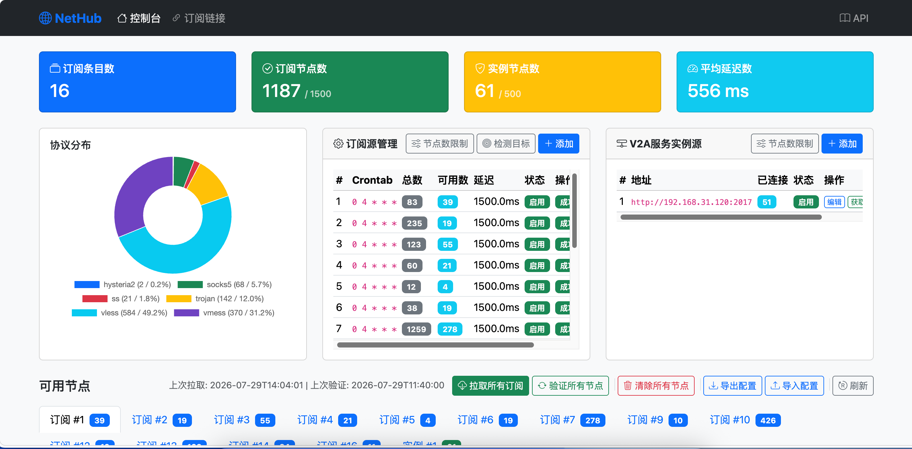

# NetHub v2.1.0

自动获取、检测、维护节点池，提供 Web 管理界面和订阅链接输出。



## 功能特性

- **订阅源管理** - 数据库驱动的增删改查，每个订阅源独立配置 Crontab、延迟阈值、并发数；删除订阅源时自动清除其下所有节点
- **Crontab 定时拉取** - 每个订阅源支持 5 位 Crontab 表达式，内置随机延迟（0~10 分钟）避免多源同时更新
- **内核转发检测** - Xray 内核转发后检测连通性，TCP/TLS 直接检测作为回退；多目标 URL 轮询 + 响应体验证 + 检测重试
- **检测失败直接删除** - 取消失败计数累积，检测不通过的节点直接从数据库删除
- **节点-订阅绑定** - 每个节点绑定所属 `subscription_id`，已存在于其他订阅的节点不重复入库
- **双库管理** - 订阅节点库（`proxies`）和实例已验证库（`verified_proxies`）分开管理，对外订阅输出合并去重
- **实例源精准同步** - 基于实例节点身份 `(instance_node_name, instance_node_address)` 精准匹配，link 变化时 UPDATE 而非重复 INSERT
- **全局节点限制** - 订阅节点和实例节点分别设置独立的全局上限，超出按延迟最高+入库最久优先删除
- **纯文本订阅输出** - 每行一条原始代理 URI；同时提供 Clash（YAML）格式
- **多协议支持** - vmess / vless / trojan / ss / hysteria2 / socks5 / http(s) 解析、检测与 Clash 配置生成
- **Clash YAML 订阅解析** - 支持解析 Clash 格式的 YAML 订阅源，自动识别并转换为内部节点格式
- **智能解析容错** - 自动跳过注释行（`#`/`//`），解析失败行去除 BOM、emoji、控制字符等行首特殊字符后重试
- **服务实例源** - 登录 v2rayA 实例获取已连接节点，入库已验证库并检测延迟；支持手工导入实例源中的订阅地址
- **配置导出/导入** - 一键导出订阅源、实例源和节点限制配置为 JSON 文件（含时间戳），导入时自动去重
- **UTC+8 时区统一** - 所有服务时间统一为东八区
- **单文件日志** - 不归档、不保留历史日志
- **Docker 部署** - Docker Compose 一键启动，内存资源限制

## 性能优化

- **SQLite WAL + PRAGMA 优化** - WAL 模式、synchronous=NORMAL、8MB 缓存、temp_store=MEMORY
- **复合索引** - subscription_id + created_at、latency_ms + fail_count + subscription_id 双索引加速查询
- **统计信息内存缓存** - 数据不变时直接返回缓存，避免重复 SQL 查询
- **独立 HTTP 连接** - 每次检测创建独立连接（force_close=True），检测结束立即销毁，无连接池残留
- **批量数据库操作** - 逐条插入实时刷新、合并元信息更新为单次 commit
- **N+1 查询优化** - IN 批量查询替代逐个 get_proxy_by_link
- **前端 JSON API 局部刷新** - 并行请求 3 个 JSON API 局部更新页面，替代整页 DOMParser 解析
- **协议分布图动态更新** - 15 秒统计刷新同步更新 Chart.js 饼图
- **CDN 预连接 + async/defer** - dns-prefetch、preconnect 提前建立连接；Chart.js async、Bootstrap JS defer 不阻塞首屏

## 快速开始

### Docker Compose（推荐）

```bash
git clone https://github.com/your-username/NetHub.git
cd NetHub

# 按需修改配置
vim config.yaml

# 启动服务
docker-compose up -d
```

访问 http://localhost:2020 查看 Web 界面。

### 本地运行

```bash
# 安装依赖
pip install -r requirements.txt

# 启动服务
python -m app.main
```

## 配置说明

编辑 `config.yaml`：

```yaml
server:
  host: "0.0.0.0"
  port: 8080
  debug: false

database:
  path: "data/proxy_pool.db"

check:
  timeout: 5.0                   # 检测超时（秒）
  max_concurrent: 50             # 全局并发检测数
  latency_threshold: 1500.0      # 全局延迟阈值（毫秒）
  check_mode: "auto"             # 检测模式: auto(优先内核转发回退TCP) / http(仅内核转发) / tcp(仅TCP/TLS)
  socks_port: 1080               # 本地 SOCKS 转发端口
  http_port: 1081                # 本地 HTTP 转发端口
  kernel_path: "xray"            # 内核可执行文件路径
  check_retries: 2               # 单次检测失败后重试次数

scheduler:
  fetch_interval: 3600           # 拉取订阅间隔（秒）
  cleanup_interval: 86400        # 清理空订阅间隔（秒）
  max_proxies: 500               # 全局订阅节点最大数量，超出按延迟+入库时间删除
  max_instance_nodes: 0          # 全局实例节点最大数量，0=不限制
```

> 检测目标 URL 默认包含 Google 204、Gstatic 204、Cloudflare、Apple、华为连通性检测等，首次启动自动写入数据库，后续在页面「检测目标」中管理，修改即时生效。

### 环境变量

| 变量 | 说明 | 默认值 |
|------|------|--------|
| `PROXY_POOL_PORT` | 服务端口 | 8080 |
| `PROXY_POOL_DB_PATH` | 数据库路径 | data/proxy_pool.db |

## API 接口

### 节点

| 方法 | 路径 | 说明 |
|------|------|------|
| GET | `/api/proxies` | 可用节点列表 |
| GET | `/api/proxies/all` | 所有节点 |
| GET | `/api/proxies/grouped` | 按 subscription_id 分组的可用节点 |
| DELETE | `/api/proxies/{id}` | 删除节点 |
| DELETE | `/api/proxies` | 一键清除所有节点 |

### 订阅输出

| 方法 | 路径 | 说明 |
|------|------|------|
| GET | `/api/subscription/plain` | 纯文本格式（每行一条 URI） |
| GET | `/api/subscription/v2ray` | 纯文本格式（同 plain） |
| GET | `/api/subscription/clash` | Clash 格式（YAML） |

### 订阅源管理

| 方法 | 路径 | 说明 |
|------|------|------|
| GET | `/api/subscriptions` | 订阅源列表 |
| POST | `/api/subscriptions` | 添加订阅源 |
| POST | `/api/subscriptions/auto` | 自动添加（仅 URL 必填，自动拉取验证） |
| PUT | `/api/subscriptions/{sub_id}` | 更新订阅源 |
| DELETE | `/api/subscriptions/{sub_id}` | 删除订阅源及其下所有节点 |

### 拉取与验证

| 方法 | 路径 | 说明 |
|------|------|------|
| POST | `/api/fetch` | 拉取所有订阅 |
| POST | `/api/fetch/{sub_id}` | 拉取指定订阅 |
| POST | `/api/verify` | 验证所有节点 |
| POST | `/api/verify/{sub_id}` | 验证指定订阅节点 |

### 服务实例源

| 方法 | 路径 | 说明 |
|------|------|------|
| GET | `/api/instance-sources` | 服务实例源列表 |
| POST | `/api/instance-sources` | 添加服务实例源 |
| PUT | `/api/instance-sources/{source_id}` | 更新服务实例源 |
| DELETE | `/api/instance-sources/{source_id}` | 删除服务实例源 |
| POST | `/api/instance-sources/{source_id}/fetch` | 获取实例源已连接节点数 |
| POST | `/api/instance-sources/{source_id}/import-subs` | 导入实例源订阅 |

### 配置管理

| 方法 | 路径 | 说明 |
|------|------|------|
| GET | `/api/config/export` | 导出配置（JSON） |
| POST | `/api/config/import` | 导入配置（JSON，自动去重） |
| PUT | `/api/config/max-proxies` | 更新全局订阅节点限制 |
| PUT | `/api/config/max-instance-nodes` | 更新全局实例节点限制 |

### 检测目标

| 方法 | 路径 | 说明 |
|------|------|--------|
| GET | `/api/check-urls` | 检测目标 URL 列表 |
| POST | `/api/check-urls` | 添加检测目标 URL |
| DELETE | `/api/check-urls/{url_id}` | 删除检测目标 URL |

### 其他

| 方法 | 路径 | 说明 |
|------|------|--------|
| GET | `/api/stats` | 统计信息（总订阅条目数、可用节点数、平均延迟、协议分布、节点限制） |
| GET | `/api/health` | 健康检查 |

## 订阅链接使用

在节点客户端中添加以下订阅链接：

- **纯文本**: `http://your-server:2020/api/subscription/plain`
- **Clash**: `http://your-server:2020/api/subscription/clash`

> 订阅内容合并订阅节点库和实例已验证库中延迟低于阈值的可用节点，按 link 去重后输出。

## 支持协议

| 协议 | 订阅解析 | Clash 生成 |
|------|----------|-----------|
| VMess | ✅ | ✅ |
| VLESS | ✅ | ✅ |
| Trojan | ✅ | ✅ |
| Shadowsocks | ✅ | ✅ |
| Hysteria2 | ✅ | ✅ |
| SOCKS5 | ✅ | ✅ |
| HTTP/HTTPS | ✅ | ✅ |

> socks4/socks4a 协议不再支持，拉取时自动移除。

## 延迟检测原理

延迟检测模拟真实上网场景：通过 Xray 内核转发访问目标检测 URL，测量完整请求延迟。

```
客户端 → Xray 内核转发 → 目标网站
         ├── DNS 解析
         ├── TCP 连接建立
         ├── TLS 握手（HTTPS 目标）
         └── HTTP 请求/响应
```

- 检测目标包含 Google 204、Gstatic 204、Cloudflare、Apple、华为连通性检测等
- 多个目标取最大延迟值，确保所有目标均可达
- 响应体验证排除劫持页面和空响应
- 单次检测失败后自动重试（默认 2 次）
- 检测失败节点直接删除，不保留
- 每次检测使用独立 HTTP 连接，结束后立即销毁

## 项目结构

```
proxy_pool/
├── app/
│   ├── __init__.py          # 应用工厂 & 全局单例
│   ├── main.py              # 启动入口
│   ├── config.py            # YAML 配置加载
│   ├── database.py          # aiosqlite 异步数据库操作（WAL + 缓存 + 批量操作）
│   ├── models.py            # 数据模型（ProxyInfo / ProxyDBRecord / SubscriptionRecord / InstanceSourceRecord）
│   ├── parser.py            # 订阅拉取 & 解析（7 协议 + Clash YAML + 容错重试 + 实例节点匹配）
│   ├── checker.py           # 内核转发检测 + TCP/TLS 回退检测（独立连接）
│   ├── generator.py         # 纯文本 / Clash 订阅生成
│   ├── scheduler.py         # APScheduler 定时任务调度（共享 checker + 精准同步）
│   ├── routers/
│   │   ├── api.py           # REST API 路由
│   │   └── web.py           # Web 页面路由（精简序列化）
│   └── templates/
│       ├── base.html        # 基础模板（CDN 预连接 + defer + favicon）
│       ├── index.html       # 主页面（JSON API 局部刷新 + 分页 + 双库管理 + 节点限制）
│       └── subscription.html # 订阅链接页
├── logs/                    # 日志目录（单文件，不归档）
├── data/                    # 数据库目录
├── config.yaml              # 配置文件
├── docker-compose.yaml      # Docker 编排（内存限制）
├── Dockerfile               # Docker 镜像
├── CHANGELOG.md             # 变更日志
└── requirements.txt         # Python 依赖
```

## License

MIT License
